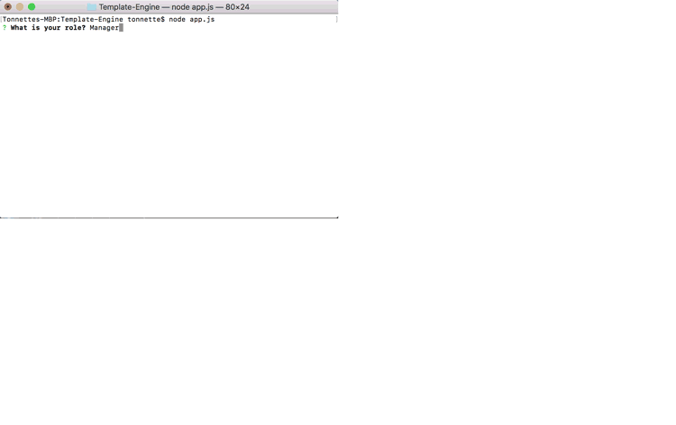

# Template-Engine
This project is a software engineering team generator command line application. The application will prompt the manager for information, and then information about the team members. The user can input any number of team members, and they may be a mix of engineers and interns. When the user has completed building the team, the application will create an HTML file that displays the team based on the information provided by the user. 

This project also has tests set-up to ensure code is working. All tests are passed!

# Gif of app

# Screen Shot of generated webpage

# github repo
https://github.com/Tonnette/Template-Engine

# Tech/framework used
This app runs as a Node CLI to gather information about each employee. User can use the CLI to generate an HTML page that displays information about their team.

This particular app was built using node.js, html, JavaScript. I used npm packages inquirer for the prompts, and npm open to automatically open the html page at the end.

Jest is also used for running the tests.

# contributors
Tonnette Stanford

# Author
Tonnette Stanford

# Licence
There is no licence and this website is open source.

